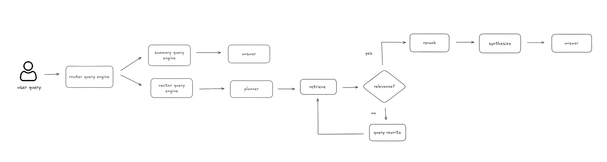

# Agentic RAG with LlamaIndex (Router + Multi-PDF Support)

A simple experiment building an Agentic Retrieval-Augmented Generation (RAG) system using LlamaIndex + Ollama, featuring:

- Router-based flow (Summary vs Detail)
- Multi-PDF ingestion (via Streamlit upload)
- Planner → Multi-retrieve → Rewrite loop → Rerank → Synthesize
- Source tracking
- Support for Bahasa Indonesia & English

This project was built to explore a more modular and transparent Agentic RAG architecture compared to standard single-shot RAG.

---

## Workflow Diagram



---

## Architecture Overview

The system has two main paths:

### 1. Summary Path

For broad or overview-type questions:

```
User → Router → SummaryIndex → Answer
```

Uses `SummaryIndex (tree_summarize)` to produce a high-level summary.

### 2. Detail Path (Agentic Mode)

For technical or analytical questions:

```
User
  ↓
Router (LLM selector)
  ↓
Planner (generate 3–5 subtopics)
  ↓
Retrieve (vector index)
  ↓
Relevance check
    ├─ If empty → Rewrite query → Retrieve again
    └─ If sufficient → Continue
  ↓
Rerank
  ↓
Synthesize final answer
```

This mode performs multi-step reasoning and combines evidence from multiple documents.

---

## Project Structure

```
project/
├── main.py                # CLI version (static data folder)
├── config.yaml
├── requirements.txt
├── src/
│   ├── config.py
│   ├── models.py
│   ├── indexing.py
│   ├── engines.py
│   ├── routing.py
│   └── agentic.py
├── templates/
│   ├── index.html
└── app.py                 # FastAPI app (multi PDF upload)

```

---

## Features

- Router-based decision between summary and detailed reasoning
- Multi-document retrieval in a single vector space
- Automatic query rewrite if retrieval returns insufficient evidence
- Reranking using SentenceTransformer
- Source file tracking
- Streamlit interface for dynamic PDF ingestion

---

## Installation

### 1. Create a virtual environment

```bash
python -m venv venv
source venv/bin/activate  # Mac/Linux
venv\Scripts\activate     # Windows
```

### 2. Install dependencies

```bash
pip install -r requirements.txt
```

### 3. Start Ollama

Make sure Ollama is running:

```bash
ollama serve
```

Pull your model if needed:

```bash
ollama pull llama3
```

---

## Usage

### CLI Mode (Static Data Folder)

Place your PDF files inside the folder specified in `config.yaml` under:

```yaml
data-rag:
  data_dir: ...
```

Run:

```bash
python main.py
```

### Streamlit Mode (Multi-PDF Upload)

Run:

```bash
streamlit run app/app.py
```

Upload multiple PDFs via the sidebar, build the index, then start asking questions.

---

## Example Questions

**Summary Mode**
- Summarize the comparison between Transformer and Vision-Language Models across the documents.
- Provide a high-level overview of how self-attention is used across the documents.

**Detail Mode**
- How does the self-attention mechanism enable text and image integration in Vision-Language Models?
- What evaluation metrics were used to compare different Transformer variants?

---

## Trade-offs

- Detail mode requires multiple LLM calls (planner + retrieval loop + synthesis), which increases latency.
- Relevance checking is basic (empty evidence fallback).
- No automated evaluator or hallucination detection yet.
- Not optimized for low-latency production use.

> This project is intended for experimentation and architectural exploration.

---

## Why LlamaIndex?

For this use case:

- Cleaner abstraction for indexing and routing
- Built-in `RouterQueryEngine`
- Simpler integration with reranking
- Less boilerplate compared to more verbose agent frameworks

---

## Future Improvements

- Add automatic answer evaluation (faithfulness / relevance scoring)
- Implement adaptive retrieval thresholds
- Add hybrid retrieval (BM25 + dense)
- Introduce conversation memory
- Add benchmarking vs single-shot RAG

---

## License

Experimental project for research and learning purposes.
